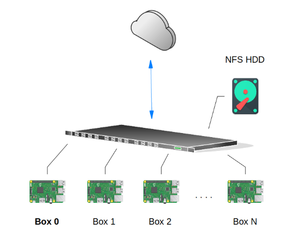

.. _intro:

================================================================
Introduction
================================================================

.. toctree::
   :maxdepth: 2

Clox is a Cloud platform designed with simplicity in mind. It is meant to be run on Single Board Computers (SBC) based on ARM processors. Raspberry Pi 3 is the only SBC supported at the moment, we are currently working on adding support for Pine64 and more should come after. 

For testing Clox you will only need a Supported SBC and deploy the first node, called "**box0**", see :ref:`the_short_road_first_node`. For production environments you will need two or more supported SBC, depending on how many services you will deploy. You will also need an external hard drive disk that supports NFS, check :ref:`the_short_road_NFS_datastore`. Finally, you need one or more switches (depending on how many SBCs and HDDs you are using) to interconnect everything. The physical design, on it most simple form, should look like this:

For a quick deployment you should follow :ref:`The short road <the_short_road_overview>`. Clox is totally free and open. All the software used is OpenSource and you can check how everything was integrated by following :ref:`The not so short road <the_not_so_short_road_overview>`. There, you will find how to do it all by yourself and even contribute to the project.
