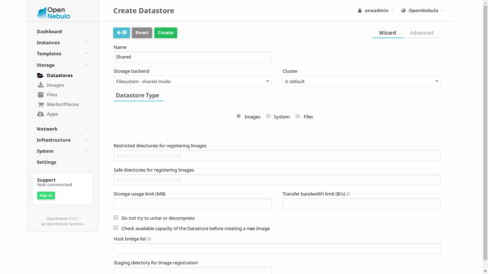

.. include:: ../vars.rst
.. _pine64_the_short_road_NFS_datastore:

******************************************
NFS Datastore
******************************************

This guide intends to describe the process of adding an NFS datastore. 

.. note::
    This NFS datastore is optional but recommended. If you do not use this datastore and instead keep using the default OpenNebula's datastore which uses ssh as transfer driver the container will start slowly and will not run as smoothly as it should.
    This datastore will become a bottleneck once your cluster gets big. When this happens you can add more NFS datastores to distribute load (more info here `<http://docs.opennebula.org/>`_ or deploy a SAN if your budget allows it. For the second case Ceph is recommended. It integrates smoothly with OpenNebula and LXDoNe and it has been used on production environments.

NFS disks should work fine and there are a lot on the market. You can also use a Linux PC for the NFS export if you do not have one or do not want to use it. Instructions for using NFS disks vary depending the model, you are on your own there, but is really simple generally speaking. Now instructions are provided for using a Linux PC for the share.

1. Using a Linux PC for the share (optional)
====================================================

1.1. Install
---------------------------------
First, install NFS server. Package will change it's name depending on the distro.

For Debian based distros:

.. prompt:: bash # auto

    # apt install nfs-common

For Arch Linux:

.. prompt:: bash # auto

    # pacman -S nfs-utils

Check Service is running

.. prompt:: bash # auto

   # systemctl status nfs-server 

1.2. Configure
---------------------------------

Create folder that will be shared and change folder mode bits. "**/shared/folder**" is the route in the server from the folder that will be shared. It is being assumed that the default addressing is being used, which means every Clox node is inside the IP range "**192.168.0.0/24**". 

.. prompt:: bash # auto

    # mkdir /shared/folder
    # chmod 777 /shared/folder
    # echo "/shared/folder 192.168.0.0/24(rw,sync,no_subtree_check,no_root_squash,crossmnt,nohide)" >> /etc/exports

Reload the share and make sure the server is running

.. prompt:: bash # auto

    # exportfs -arv

2. Frontend
==========================================

2.1. Create datastore
----------------------------------

You need to enter OpenNebula's frontend now. Go to `<http://192.168.0.9:9869/>`_. Default username and password is "**oneadmin**".

.. include:: ../common/clock_fix.rst

Now go to **Storage** --> **Datastores** and click the green button with a plus sign to create a new datastore.

Set a name for the new datastore. Storage backend should be **Filesystem - Shared mode**. Set **Images** as Datastore Type. 

.. _pine64_mountNFS_datastore:

3. Mount
=========================================

Now you need to mount the NFS share on the frontend and on every virtualization node. 

.. warning::
   Once again, remember this step needs to be performed on the frontend and on every virtualization node. Remember also, in case you have only deployed "**box0**" that there are two nodes inside "**box0**", a virtualization node with IP "**192.168.0.10**" and the frontend with IP "**192.168.0.9**". Perform this step in both of them.

Enter through ssh to the frontend and every virtualization node, make sure nfs is installed, create datastore's folder and add the mount point to fstab.

.. note::
    "**<IP>**" is the NFS server's IP providing the share. "**<DATASTORE_ID>**" is the NFS datastore's ID. If this is the first datastore you created the ID should be 100.

.. prompt:: bash # auto

    # mkdir /var/lib/one/datastores/<DATASTORE_ID>
    # chown oneadmin:oneadmin /var/lib/one/datastores/<DATASTORE_ID>
    # echo "<IP>:/shared/folder /var/lib/one/datastores/<DATASTORE_ID> nfs soft,intr,rsize=32768,wsize=32768,auto" >> /etc/fstab
    # mount /var/lib/one/datastores/<DATASTORE_ID>

NFS Datastore is ready, now start adding nodes!

