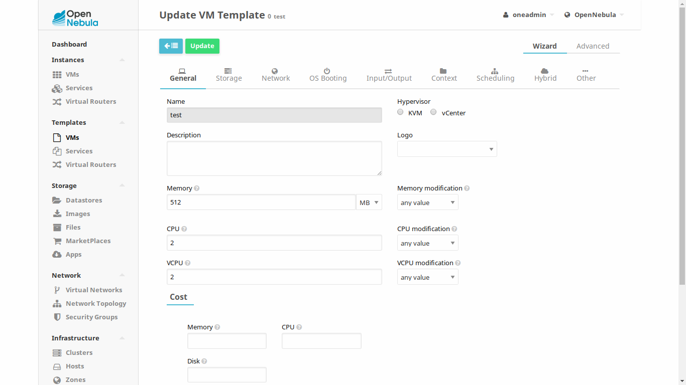

.. include:: ../vars.rst

.. _pine64_the_short_road_new_container:

******************************************
New containers deployment guide
******************************************

Here you will find how to deploy a new containers. This containers will behave just like a typical virtual machine. They use |architecture| architecture and should be contextualized so OpenNebula will be able to manage certain parameters inside. A ready to use, `basic container`_ is provided. You should use it as your base container and deploy services on it. If you want to create one by yourself, `here <https://github.com/OpenNebula/addon-lxdone/blob/master/Image.md>`_ you will find how to do it.

.. note::
    Containers are just as any typical virtual machine but lighter and faster.

1. Get a container
==========================================

Download `basic container`_ and decompress it.

1.1. Upload image to OpenNebula
----------------------------------

You need to enter OpenNebula's frontend now. Go to `<http://192.168.0.9:9869/>`_. Default username and password is "**oneadmin**".

Now go to **Storage** --> **Images** and click the green button with a plus sign upload a new image. Provide a name, set "**Operating System Image**" under Type, set Datastore where this image will be uploaded (you should use the just created NFS datastore) and check "**This image is persistent**" checkbox if you want changes to this image to be persistent (most likely).

2. Deploy container
==========================================

2.1. Create new template
------------------------------

Templates contain virtual machine's information. You need to create a template in order to instantiate a new virtual machine.

Inside OpenNebula's web interface, go to **Templates** --> **VMs** and click the green button with a plus to add a new template. Under "**General**", assign a name and set required RAM and CPU resources. 

Then, go to "**Storage**" and select the recently uploaded image. You can add as many Network Interface Cards (NICs) under "**Network**".

2.2. Instantiate template
------------------------------

Now you should instantiate a new virtual machine from the template you just created. Inside OpenNebula's web interface, go to **Instances** --> **VMs** and click the green button with a plus to add a new Virtual Machine. Now, select template and hit create. 

If everything was done properly, you should see **RUNNING** status.

