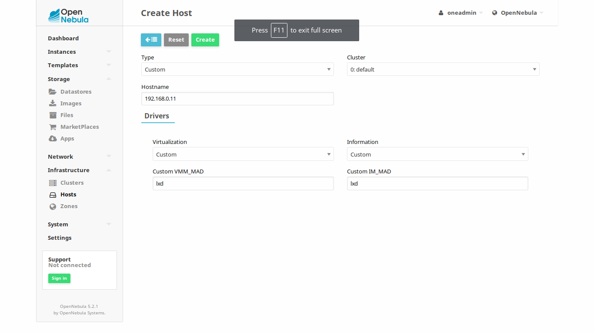

.. include:: ../vars.rst

.. _rpi3_the_short_road_new_node:

******************************************
New node deployment guide
******************************************

This guide intends to describe the process of deploying a compute node based on |distro| on a |SBC_model| from a pre-configured image provided by us. If you want to know more about how this image was created or create your own, check :ref:`the_not_so_short_road_node_installation`. You will need a microSD card with at least 4GB and preferably class 10 or better.

.. note::
    * Read **Notes** sections attached to some steps, before using the shell
    * Commands prefixed by "**#**" are meant to be run as root. Commands prefixed by "**$**" must be run as a normal user.
    * ``(...)`` in code snippets means that could be code before/after the modified lines. That portion of code need to stay unmodified.

1. Get and install basic node
==========================================
With the image provided by us you will have a node ready to be linked to your cluster. You just have to download it and follow these steps.

1.1. Download image
-------------------------------------------------------------
Download `Box99`_.

1.2. Dump image on a microSD card
-------------------------------------------------------------

1.2.1. If you use Linux
^^^^^^^^^^^^^^^^^^^^^^^^^^^^^^^^^^^^^^^^^^^^^^^^^^^^^^^^^^^^^^^^^
I will assume **/dev/mmcblk0** is your microSD card. Please check. 

.. prompt:: bash # auto

    # dd if=./image_name.img of=/dev/mmcblk0 && sync

1.2.2. If you use Windows
^^^^^^^^^^^^^^^^^^^^^^^^^^^^^^^^^^^^^^^^^^^^^^^^^^^^^^^^^^^^^^^^^
Sorry, still no idea :)
`This link <https://www.raspberrypi.org/documentation/installation/installing-images/>`_ might help.

1.3. Turn it on
-------------------------------------------------------------
Connect the microSD to your |SBC_model|, connect it to the cluster's network and turn it on.

2. Configure node 
==========================================
You need only a few adjustments to add this node to the cluster.

2.1. Set IP address and hostname
-------------------------------------------------------------
This image comes with IP address **192.168.0.99** and hostname **box99** by default. You need to change this. Your **box0** comes with IP address **192.168.0.10** configured by default. You might want to add new nodes as **192.168.0.11** for **box1**, **192.168.0.12** for **box2** and so on. Let us assume we are deploying "**box1**". If not, adjust accordingly.

.. prompt:: bash # auto

    # hostname box1
    # sed -i -e 's/box99/box1/g' /etc/hostname
    # sed -i -e 's/box99/box1/g' /etc/hosts
    # sed -i -e 's/192.168.0.199/192.168.0.11/g' /etc/network/interfaces
    # service networking restart

2.2. Configure Passwordless SSH
-------------------------------------------------------------
OpenNebula greatly explains this step. Check it `here <http://docs.opennebula.org/5.4/deployment/node_installation/kvm_node_installation.html#step-4-configure-passwordless-ssh>`_. If you are as lazy as me here you have a quick way to achieve this ;).

Set a temporary password for oneadmin user on the new node:

.. prompt:: bash # auto

    # passwd oneadmin

Log in to the frontend and as user oneadmin execute this:

.. prompt:: bash $ auto

    $ ssh-keyscan **opennebula** <192.168.0.10> <192.168.0.11> <192.168.0.12> ... > /var/lib/one/.ssh/known_hosts

.. note::
    In this case, **opennebula** is the frontend's hostname. Only use the hostname for this host. Use the node's IP address for the rest of the nodes. Keep adding IPs according to the amount of nodes you have already deployed.

.. note::
    Remember, the frontend is an LXD container running inside box0. By default, 192.168.0.9 is the IP address. You can establish an ssh connection with **cloud** as the username and password. That is the same username and password configured by default on the nodes.

Now, still in the frontend as user oneadmin, copy the directory **/var/lib/one/.ssh** to all the compute nodes nodes:

.. prompt:: bash $ auto

    $ scp -rp /var/lib/one/.ssh 192.168.0.10:/var/lib/one/
    $ scp -rp /var/lib/one/.ssh 192.168.0.11:/var/lib/one/
    $ scp -rp /var/lib/one/.ssh 192.168.0.12:/var/lib/one/
    $ ...

You should verify that connecting from the Frontend, as user `oneadmin`, to the nodes and the Front-end itself, and from the nodes to the Front-end, will not ask for password:

.. prompt:: bash $ auto

    $ ssh **opennebula**
    $ exit

    $ ssh <node1>
    $ ssh <frontend>
    $ exit
    $ exit

    $ ssh <node2>
    $ ssh <frontend>
    $ exit    $ exit

    $ ssh <node3>
    $ ssh <frontend>
    $ exit
    $ exit

2.3. Configure NFS (optional)
-------------------------------------------------------------

If shared datastore(s) via NFS are being used, remember to configure it on the node. Follow :ref:`rpi3_the_short_road_NFS_datastore` **only on this new node**.

3. Add new node on OpenNebula
==========================================

First log in to OpenNebula. The url will be http://192.168.0.9:9869. "**oneadmin**" is the default username and also the password.

Now go to **Infrastructure** --> **Hosts** and click the green button with a plus to add a new node.

Under "**Type**" set Custom. Provide the node's IP address as hostname. This will be 192.168.0.11 for box1. Under "**Virtualization**" and "**Information**" leave Custom. Write **lxd** on "**Custom VMM_MAD**" and "**Custom IM_MAD**". Then click create.

Now you are ready! For any new node you want to add just read this page again. On the next guide a few basics of OpenNebula will be provided and it will be shown how to deploy new containers on Clox.

.. include:: ../common/clock_fix.rst

